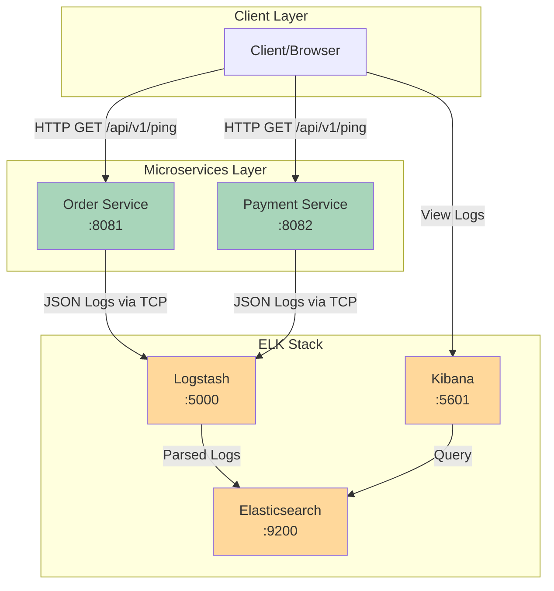
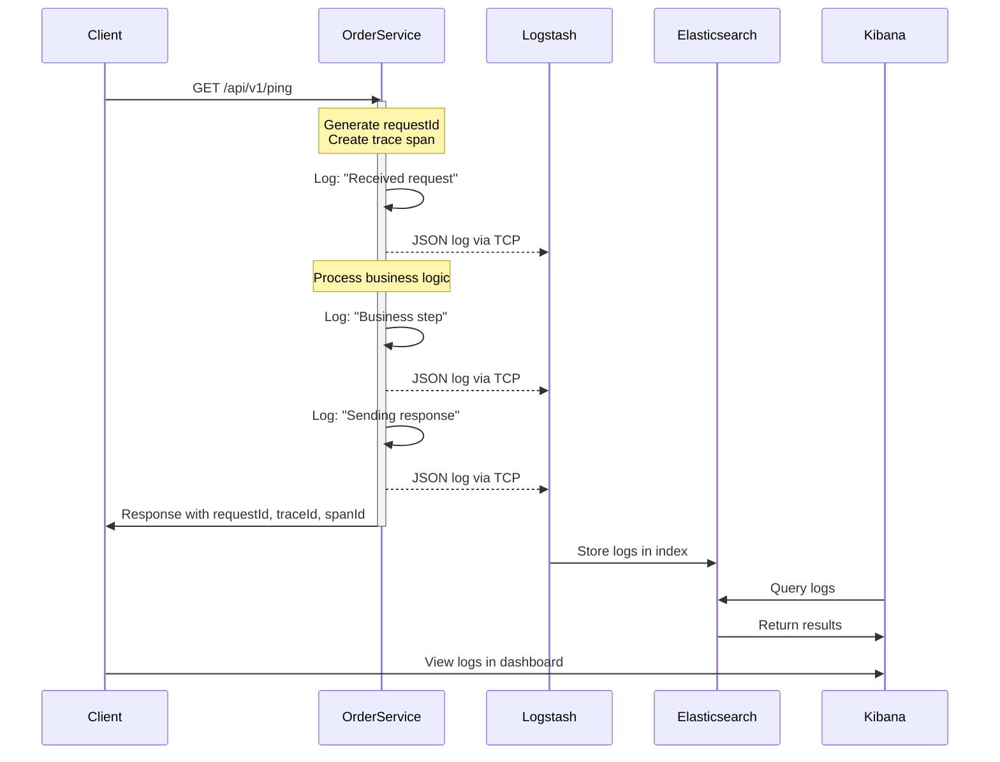
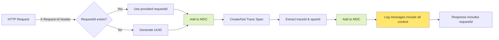
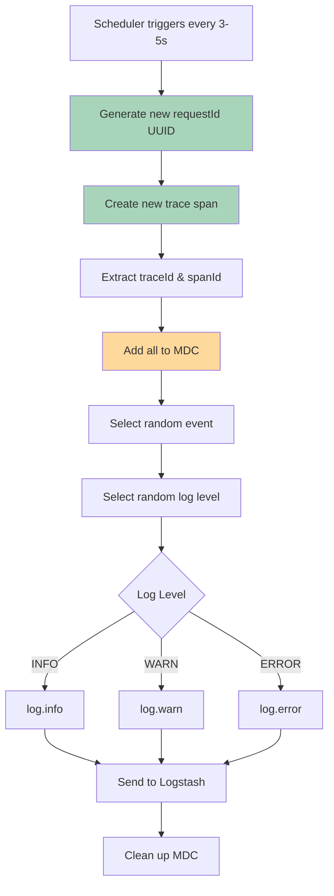
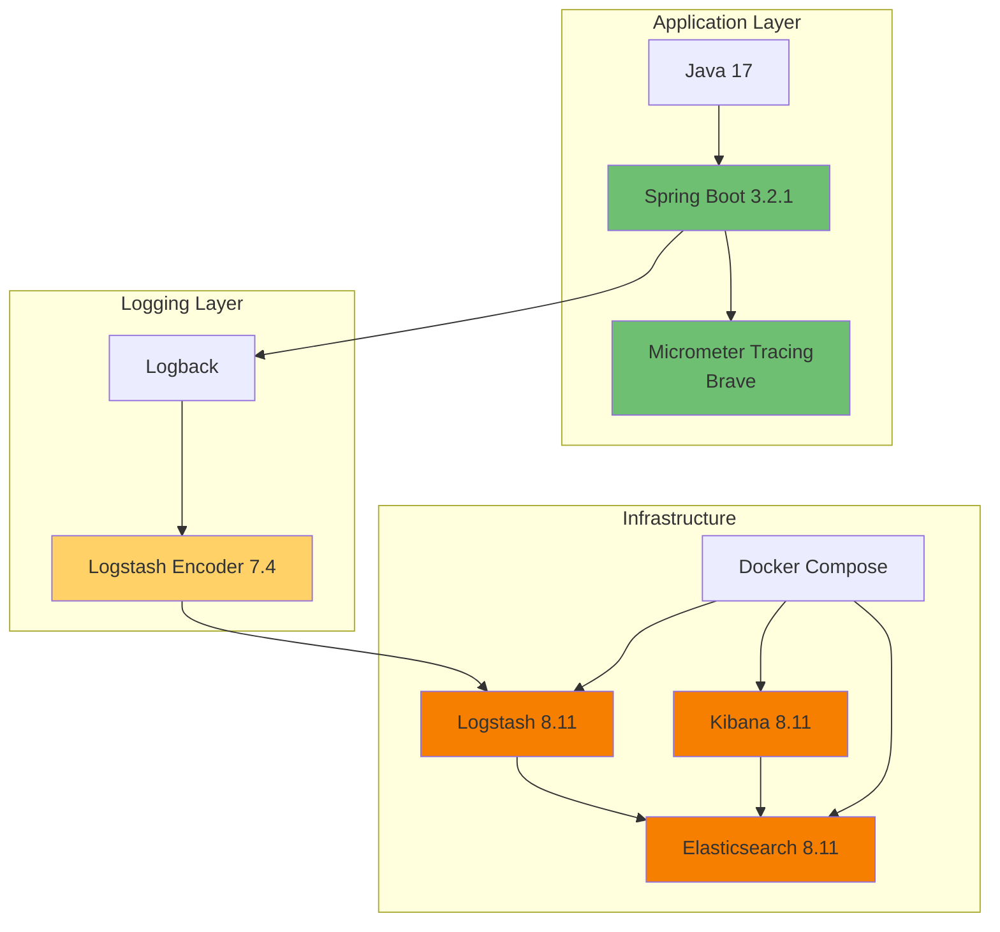

# Architecture Diagram

## System Architecture



## Log Flow



## Request ID & Trace Flow



## Scheduled Log Generation



## Technology Stack



## Data Model

### Log Entry Structure

```json
{
  "@timestamp": "ISO8601 datetime",
  "service.name": "string",
  "requestId": "UUID string",
  "traceId": "hex string",
  "spanId": "hex string",
  "level": "INFO | WARN | ERROR",
  "message": "string",
  "logger": "fully.qualified.class.name",
  "thread": "thread-name",
  "stack_trace": "string (only on ERROR)"
}
```

### Key Features

- **Consistent Field Names**: All services use same field structure
- **Trace Context Propagation**: traceId/spanId maintained across services
- **Request Correlation**: requestId for tracking user requests
- **Time-based Indexing**: Daily indices for efficient querying
- **Async Processing**: Non-blocking log shipping to Logstash
